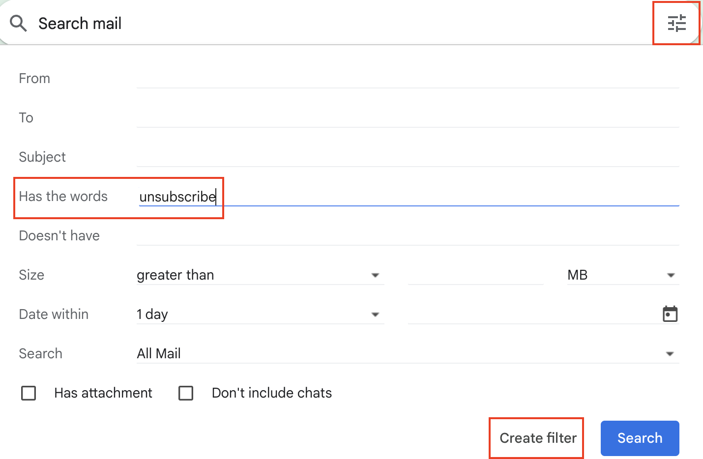
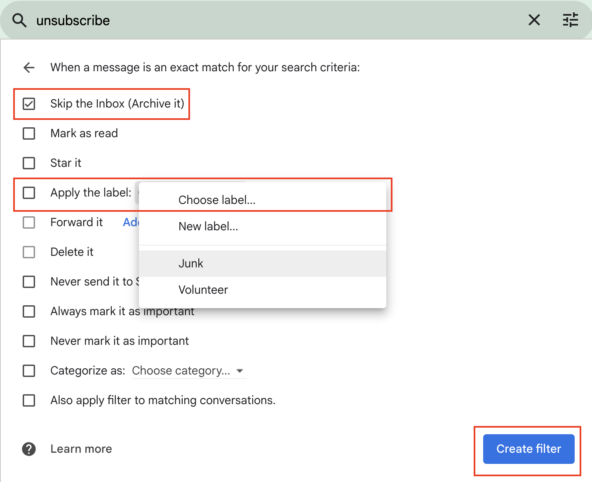
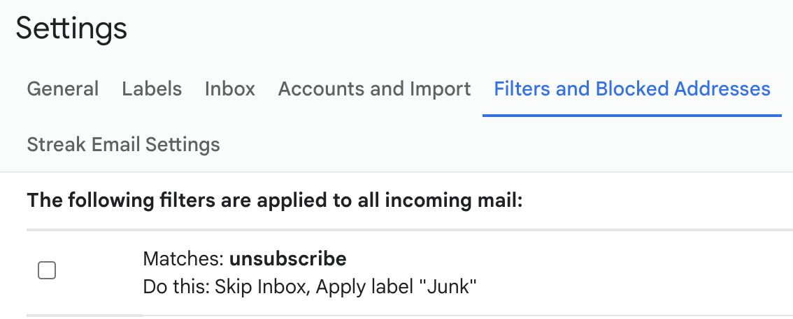

<h1 align="center">

InboxCleaner
</h1>

> A v3 manifest-based Chrome extension that parses a user's Gmail mailbox and generates a list of email subscriptions with their associated hyperlinks. Its purpose is to enable people to better manage their cluttered inboxes, which are often overrun by company newsletters that they aren't interested in.

- [Demo](#demo)
- [Technologies](#technologies)
- [Features](#features)
- [Future Mailbox Management Tips](#future-mailbox-management-tips)
- [Other](#other)
- [Attributions](#attributions)

## Demo

## Technologies

- InboxSDK (v2.0.1)
- Gmail API (v1)

## Features

As of 9/26/2023, InboxCleaner supports the following features:

- `Sync Now`: click this button to start parsing your mailbox for all email subscriptions since the last time you synced. (only tested with 3300 in my inbox, 2014 of which were subscriptions).
  - Note: It queries your Gmail mailbox for threads that contain "subscribe". Venmo is one example where its emails are not subscriptions, but match the query because it contains the word query.
  - You also need to revoke the cached identity token at chrome://identity-internals/ if you want to switch between google accounts and clean their inbox.
- `Reset`: click this button to empty the browser's cached email subscriptions.
- `Unsubscribe`: click this to navigate to the url where you can submit the unsubscription form. If it does not appear, click the address and manually find the link to unsubscribe.
- Click the sender email address to search and view all threads that they've sent. Tends to also display emails that were not subscriptions.
- Use the checkboxes and/or the trash icon to remove individual subscriptions.
- `Trash X threads`: click this button to delete all threads from this sender.
  - Note: I only tested by deleting 232 threads with 1 click, and it's possible that it takes 2-3 seconds to each time. I don't know what happens if you click this and other rows multiple times.

## Future Mailbox Management Tips

After using this extension to filter out and unsubscribe to all the emails, you probably don't need it anymore. You'll be able to manually manage future emails.

Follow the instructions below to automatically filter out emails that have subscriptions out of your inbox and into the category with the `Junk` label. You can also customize this how you'd like, if you do want to keep some of your email subscriptions.

1. In Gmail, click the icon in the right of the search bar, and type in the `unsubscribe` key word for Gmail to filter. Then click `Create filter`.

1. You'll be asked to set some actions for when an email is received and matches your filter. I personally choose to archive it and apply a custom label `Junk`. Click `Create filter` to finalize it.

1. Now, your actions will be applied to all future emails that match this filter. You can manage, edit, and delete this filter by going to the top right and clicking the Settings (gear icon), and following `See all settings > Filters and Blocked Addresses`.

## Other

View a list of the current [issues](https://github.com/ehuang47/InboxCleaner/issues) or the [project](https://github.com/users/ehuang47/projects/1/views/1?groupedBy%5BcolumnId%5D=56045934).
View more documentation on the [wiki](https://github.com/ehuang47/InboxCleaner/wiki).

## Attributions

| Asset | Source |
| -- | -- |
| [Subscription icon](./images/subscribe.png) | [Danteee82](https://www.flaticon.com/free-icon/subscribe_7048370?term=subscription&page=1&position=7&origin=tag&related_id=7048370) |
| [InboxCleaner icon](./images/cleaning.png) | [kerismaker](https://www.flaticon.com/free-icon/cleaning_6792371?term=inbox+cleaner&page=1&position=1&origin=search&related_id=6792371) |
