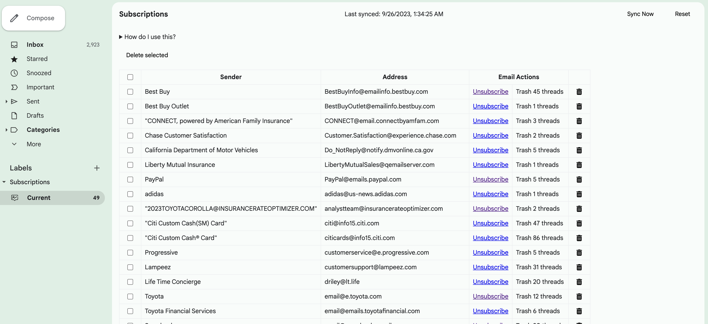

<h1 align="center">

InboxCleaner
</h1>

> A v3 manifest-based Chrome extension that parses a user's Gmail mailbox and generates a list of email subscriptions with their associated hyperlinks. Its purpose is to enable people to better manage their cluttered inboxes, which are often overrun by company newsletters that they aren't interested in.

- [Demo](#demo)
- [Technologies](#technologies)
- [Other](#other)
- [Attributions](#attributions)

## Demo

## Technologies

- InboxSDK (v2.0.1)
- Gmail API (v1)

## Other

View a run-down of the features and some other documentation at the [wiki](https://github.com/ehuang47/InboxCleaner/wiki).
View a list of the current [issues](https://github.com/ehuang47/InboxCleaner/issues) or the [project](https://github.com/users/ehuang47/projects/1/views/1?groupedBy%5BcolumnId%5D=56045934).

## Attributions

| Asset | Source |
| -- | -- |
| [Subscription icon](./images/subscribe.png) | [Danteee82](https://www.flaticon.com/free-icon/subscribe_7048370?term=subscription&page=1&position=7&origin=tag&related_id=7048370) |
| [InboxCleaner icon](./images/cleaning.png) | [kerismaker](https://www.flaticon.com/free-icon/cleaning_6792371?term=inbox+cleaner&page=1&position=1&origin=search&related_id=6792371) |
